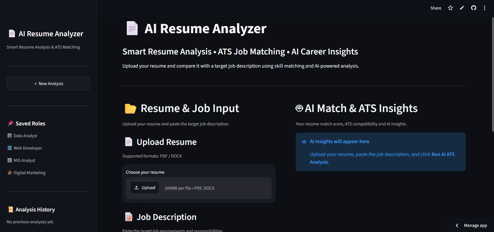

# 📄 AI Resume Analyzer — ATS Job Matcher

An AI-powered resume analysis tool built with Python and Streamlit to help job seekers compare their resumes with job descriptions, identify skill gaps, and improve their job applications.

## 🚀 Live Demo

**Live App:** [Open AI Resume Analyzer](https://ai-resume-analyzer-bfitwuunrnrjb6zcktrqjf.streamlit.app/)

## 📸 Application Preview



## ✨ Features

* 📄 Upload resumes in PDF and DOCX formats
* 🎯 Compare resume skills with job requirements
* 📊 View resume match score and skill breakdown
* 🔍 Identify missing skills and ATS keyword gaps
* 🤖 Generate AI-powered resume feedback
* ✍️ Get resume-tailoring suggestions
* 💌 Generate a customized cover letter
* 📥 Download an analysis report

## 🛠️ Tech Stack

* Python
* Streamlit
* OpenAI API
* PyPDF
* python-docx

## 💻 Run Locally

1. Clone this repository:

   ```bash
   git clone https://github.com/hanijethva05-ops/ai-resume-analyzer.git
   ```

2. Open the project folder:

   ```bash
   cd ai-resume-analyzer
   ```

3. Install dependencies:

   ```bash
   pip install -r requirements.txt
   ```

4. Create a `.env` file and add your OpenAI API key:

   ```env
   OPENAI_API_KEY=your_api_key_here
   ```

5. Start the application:

   ```bash
   streamlit run app.py
   ```

## 🔐 Security

Never commit your `.env` file or expose your API key publicly.

## ⚠️ Disclaimer

The match score is an estimate based on the application's matching logic. It does not guarantee ATS acceptance or a job interview.

## 👨‍💻 Author

**Hani Jethva**

Built as a portfolio project to explore AI-powered resume analysis and job matching.
